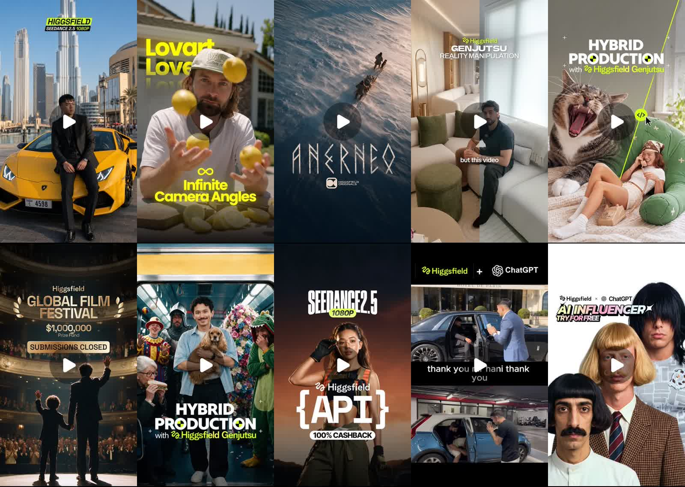

# 10 רילס המקור (נאסף 2026-10-05)

## DcDrXjXsLcU
- URL: https://www.instagram.com/edbert_yienson/reel/DcDrXjXsLcU/
- Thumbnail (visual): Asian man in black suit sitting on yellow Lamborghini Huracan in Dubai, Burj Khalifa behind; "HIGGSFIELD SEEDANCE 2.5 1080P" badge
- Caption/stats:

> 19K likes, 24K comments - edbert_yienson on August 15, 2026: "Comment “Dubai” 🔥 and I'll send the full prompt + workflow.
> 
> I just filmed myself from top of skyscrapers down to the road, where you see me driving a Lamborghini Huracan in a black suit
> 
> Everything was generated with precise camera directions, realistic vehicle movement, and cinematic lighting using Seedance 2.5 🚀
> 
> Pure realism. Pure AI filmmaking.
> 
> Inspired by @menezes.ai ✨ go check out his amazing work!
> 
> Made entirely with Seedance 2.5 1080p on @higgsfield.ai 🚀
> 
> #Seedance2 #Seedance25 #Higgsfield #HiggsfieldCreator #aifilmmaking". 

## DclqVvdqvZw
- URL: https://www.instagram.com/rourke/reel/DclqVvdqvZw/
- Thumbnail (visual): Man in cap juggling lemons outdoors, text "Lovart Love / ∞ Infinite Camera Angles" yellow
- Caption/stats:

> 72K likes, 8,635 comments - rourke on August 28, 2026: "One clip. Infinite camera angles 🔥😳
> 
> Comment “AI” to try it yourself! @lovart.ai 
> 
> Lovart lets you run Seedance 2.5 on your original footage and pull any angle you want out of a single take, close-up, wide, low, overhead, without reshooting a thing. Coverage that used to need a full crew and a second setup day now comes from one clip. Huge for filmmakers, editors, and advertisers who need cinematic options in the edit.
> 
> #LovartAI #Seedance #AIFilmmaking #CameraAngles #CreativeAI". 

## Dd1xCWei0CF
- URL: https://www.instagram.com/higgsfield.ai/reel/Dd1xCWei0CF/
- Thumbnail (visual): Aerial of dog sled crossing snow, title "ANERNEQ" Higgsfield Originals
- Caption/stats:

> 4,648 likes, 2,863 comments - higgsfield.ai on September 28, 2026: "Our newest AI film solved some of the hardest challenges in AI filmmaking.
> 
> Comment “UNLOCK” to get the prompts 🖇️
> 
> From natural handheld camera movement to realistic firelight and detailed snow textures.
> 
> ANERNEQ, our new 20-minute Arctic drama, is now open source.
> 
> Every prompt and asset is public.". 

## Dd6gkuVR7jS
- URL: https://www.instagram.com/sidequestpat_/reel/Dd6gkuVR7jS/
- Thumbnail (visual): Man on sofa in bright living room, "Higgsfield GENJUTSU REALITY MANIPULATION", split screen wipe, caption "but this video"
- Caption/stats:

> 3,216 likes, 3,131 comments - sidequestpat_ on September 30, 2026: "This combo is unholy.
> 
> Use Genjutsu to manipulate reality and the look of your entire video.
> Then throw it into Seedance 2.5 to create infinite angles.
> 
> Look at the results.
> 
> Comment ‘ANGLE’ and I’ll send you my exact step-by-step.
> 
> No advanced skills or big budget needed.
> 
> #aivideo #genjutsu #seedance25 #toronto #higgsfieldpartner @higgsfield.ai". 

## Ddjk5fCq1VK
- URL: https://www.instagram.com/higgsfield.ai/reel/Ddjk5fCq1VK/
- Thumbnail (visual): Screaming cat and woman on phone on green sofa, split wipe line, "HYBRID PRODUCTION with Higgsfield Genjutsu"
- Caption/stats:

> 8,746 likes, 1,467 comments - higgsfield.ai on September 21, 2026: "Comment «JUTSU» to get the link 🖇
> 
> What if creativity was the only limit?
> 
> Higgsfield Genjutsu lets your team scale hybrid production.
> 
> Shoot with your crew, then explore new locations, add visual effects, or rework the shot with AI.
> 
> Available on Higgsfield and through our API.". 

## DdmkVEgKLE4
- URL: https://www.instagram.com/higgsfield.ai/reel/DdmkVEgKLE4/
- Thumbnail (visual): Theatre stage, father and child waving to audience, "Higgsfield GLOBAL FILM FESTIVAL $1,000,000 SUBMISSIONS CLOSED"
- Caption/stats:

> 9,688 likes, 1,321 comments - higgsfield.ai on September 22, 2026: "We received 67,223 entries from 176 countries.
> 
> Submissions for the $1,000,000 Higgsfield Global Film Festival are officially closed.
> 
> We’re officially entering the judging phase.
> 
> While we prepare the shortlist, you can explore every submitted film on our website, from first-time creators to seasoned directors.
> 
> The festival shortlist is coming soon.
> 
> Comment “FESTIVAL”to get the link and explore films from all participants 🖇". 

## DdwEiL4KzVS
- URL: https://www.instagram.com/higgsfield.ai/reel/DdwEiL4KzVS/
- Thumbnail (visual): Man holding spaniel in subway car surrounded by clown, knight, flower costume, dinosaur costume - "HYBRID PRODUCTION with Higgsfield Genjutsu"
- Caption/stats:

> 11K likes, 4,226 comments - higgsfield.ai on September 26, 2026: "Hybrid-production has never been this accessible. 
> 
> Shoot with your crew, then use Genjutsu to explore new locations, replace objects or characters, add VFX, or transform the entire scene with AI.
> 
> Comment “Jutsu” for the link 🔗". 

## Ddwky9yq-Jt
- URL: https://www.instagram.com/higgsfield.ai/reel/Ddwky9yq-Jt/
- Thumbnail (visual): Woman in safety goggles and gloves, sunset bg, "SEEDANCE 2.5 1080P / Higgsfield {API} 100% CASHBACK"
- Caption/stats:

> 3,983 likes, 1,220 comments - higgsfield.ai on September 26, 2026: "Introducing Seedance 2.5 in native 1080p on Higgsfield API 🧩
> 
> 100% instant cashback on API spend.
> There’s $18M left in the pool. First come, first served.
> 
> Comment “API” to get the setup link 🖇️
> 
> The only US-based Seedance 2.5 at its highest quality yet.
> Ready for commercials and large-scale productions.
> 
> Up to $200,000 per business and $1000 per individual.
> 
> Unused cashback expires September 30.". 

## DdyIfcjSm3P
- URL: https://www.instagram.com/maorhani1/reel/DdyIfcjSm3P/
- Thumbnail (visual): Hebrew creator: top half Rolls-Royce at Hotel de Paris with chauffeur, bottom half same action with a cheap car in parking lot (before/after), captions "thank you hani thank you"; Higgsfield + ChatGPT logos
- Caption/stats:

> 144 likes, 242 comments - maorhani1 on September 27, 2026‎: "ולחשוב שאנחנו רק בהתחלה של כל המהפכה הזאת
> תגיבו ״רולס״ ואשלח לכם את המדריך המלא". ‎

## DeHZl65CI2G
- URL: https://www.instagram.com/higgsfield.ai/reel/DeHZl65CI2G/
- Thumbnail (visual): Three quirky AI-influencer-style men with odd bowl haircuts, "Higgsfield x ChatGPT AI INFLUENCER TRY FOR FREE"
- Caption/stats:

> 7,912 likes, 1,669 comments - higgsfield.ai on October 5, 2026: "Officially, every viral AI influencer was made on Higgsfield 🧩
> 
> Make one with your face or from scratch. Then jump on viral trends with Genjutsu.
> 
> Try up to 5 generations free.
> Comment “VIRAL” to get the link 🔗 
> 
> Available now in Higgsfield and via ChatGPT Extension.
> 
> Credits: @jean_philanthrope". 

